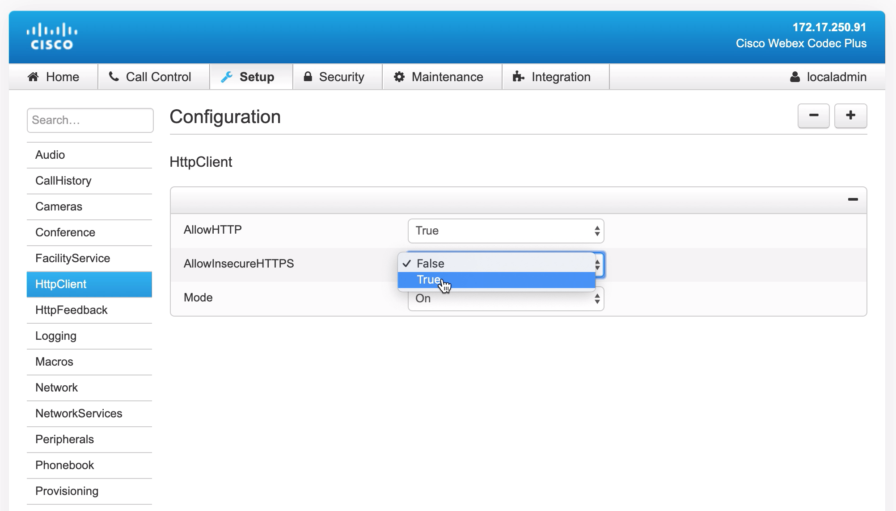
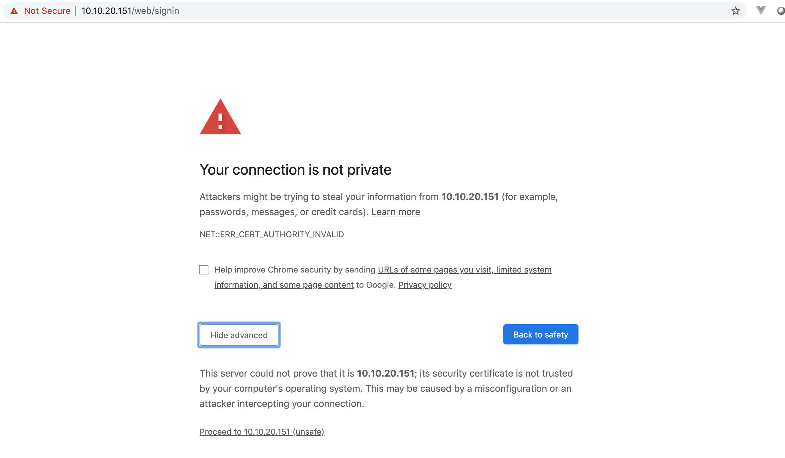
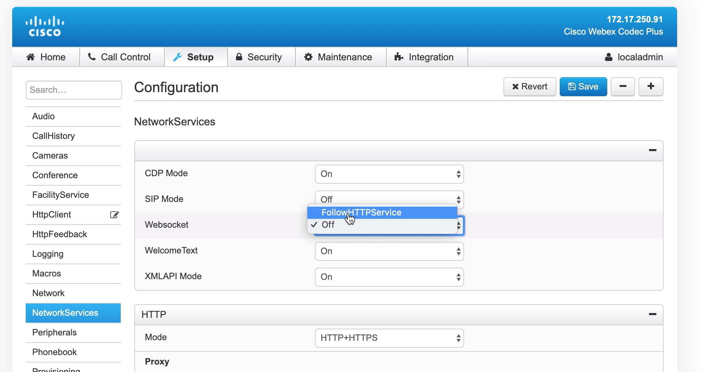
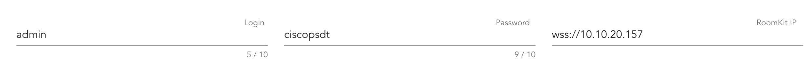

# Simple Vue.js dashboard using JSXAPI WebSockets connection


### Requirements
- [Node](https://nodejs.org/en/download/)

### Installation

```
git clone https://github.com/CiscoDevNet/sample-ws-jsxapi-vue
cd sample-ws-jsxapi-vue

# install dependencies
npm install

# serve with hot reload at localhost:8080
npm run dev

# build for production with minification
npm run build

```

Using step-by-step instructions below you will create a simple Vue app. 
In this App you create and template and Vue js methods that can process data from Webex devices.
We also create a WebSocket connection and track different types of events.

When you see a box that looks like this:

```
CLI command /OR/ JS code /OR/ HTML
```

You can read description of this block and copy this text and paste it into the IDE/terminal. 

Here is a brief cheat sheet:
For Linux:

**Copy - CTRL+INSERT**

**Paste - SHIFT+INSERT**

For Mac:

**Copy - CMD+C**

**Paste - CMD+V**

For Windows:

**Copy - CTRL+C**

**Paste - CTRL+V**

> **Note** all code is in current directory. You can compare your code and final version. In case of errors also refer to the code located in the current directory. 

### First step

Install [Node](https://nodejs.org/en/download/)

Install Vue-cli. Using Vue-cli you can start the project with some of the official Vue project templates or one of the many of the open-source Vue templates and, of course, you can create your own one and use it anywhere

```
npm install -g vue-cli
```

> A simple Vue 2.0 Webpack & `vue-loader` setup for quick prototyping. Note this template is not suitable for production - for that you may want to use the [full webpack template](https://github.com/vuejs-templates/webpack).

```
vue init webpack-simple vue-spa
```
Enter information Project name, description, Author, License, Using sass or Press Enter for choosing default variants. 

```
cd vue-spa/
npm install
```


### Vue component

There is the _index.html_ file with a simple HTML markup including only the element with identifier `app` in a body. It will be replaced by a vue-generated DOM. That is the reason why you should not use the tag _body_ as as a root element.

In the src directory we have the main.js file which is the entry point for webpack. The **Vue components** are imported here. Also, here we have a root Vue instance that has two properties for now. The property `el` provides the Vue instance with an existing DOM element to mount on. Another one is a render function which generates DOM from _App.vue_. In general, this is all we need to know about the structure of the _webpack-simple template_, not so much, isn’t it? The main part of our **Vue app** will be coded in _App.vue_. The **.vue** extension indicates that this file is a single-file vue component. It is one of the Vue’s features, let's get to know it better.


Install **[jsxapi](https://github.com/cisco-ce/jsxapi)** package.
It's set of tools to integrate with the Cisco Telepresence Endpoint APIs in JavaScript.

```
npm install --save-dev jsxapi
```

Install [Vuetify.js](https://vuetifyjs.com/en/) (Vue Material Design Component Framework)

```
npm install vuetify
```

For importing font and icons open _index.html_ and insert in `<head>` `</head>` tag

```
<link href=’https://fonts.googleapis.com/css?family=Roboto:300,400,500,700|Material+Icons' rel=”stylesheet”>
<link href="https://cdn.jsdelivr.net/npm/@mdi/font@4.x/css/materialdesignicons.min.css" rel="stylesheet">
```

Import Vuetify. In src directory open _main.js_ and insert code below after this line `import App from './App.vue'`

```
import Vuetify from 'vuetify'
import 'vuetify/dist/vuetify.min.css'
Vue.use(Vuetify)
```

### Edit configuration and enable using Websocket

Using **RoomKit GUI** you need to make next changes
Go to _Setup_ -> _Configurations_
In left menu chose _HttpClient_ settings and change _AllowInsecureHTTPS_ from False on True



Then navigate to your Room Kit gui page like https://10.10.20.30 and approve the room kit self-sign certificate in your browser


WebSocket's library that we use will indicate an error when we using HTTP

Also, Using RoomKit GUI you need to enable using Websocket

_Go to Setup_ -> _Configurations_

In left menu chose NetworkServices settings and change Websocket from off on FollowHTTPService




### Edit App.vue

In src directory open _App.vue_ file. Inside `<template>` `</template>` `<main>` `</main>` tag insert
to create form like this



We use standart [form sample](https://vuetifyjs.com/en/components/forms) 

<details><summary>CLICK ME</summary>
<p>

```
      <v-form v-model="valid" ref="form">
        <v-container>
          <v-row>
            <v-col
              cols="12"
              md="4"
            >
              <v-text-field
                v-model="login"
                :rules="nameRules"
                :counter="10"
                label="Login"
                required
              ></v-text-field>
            </v-col>

            <v-col
              cols="12"
              md="4"
            >
              <v-text-field
                v-model="password"
                :rules="nameRules"
                :counter="10"
                label="Password"
                required
              ></v-text-field>
            </v-col>

            <v-col
              cols="12"
              md="4"
            >
              <v-text-field
                v-model="ip"
                :rules="ipRules"
                label="RoomKit IP"
                required
              ></v-text-field>
            </v-col>
            <v-btn
              @click="submit"
              :disabled="!fieldIsEmpty || !valid"
              v-if="!progress">
              submit
            </v-btn>
            <v-btn
              @click="close"
              :disabled="!connection"
              v-if="!progress">
              Close connection
            </v-btn>
          </v-row>
        </v-container>
      </v-form>
```
</p>
</details>

After this, we create two [cards](https://vuetifyjs.com/en/components/cards) for collecting and displaying information.
In one of the cards, we insert form for a demo of WebSockets connection.
We can change the System Unit Name for testing online tracking this type of change. 

<details><summary>CLICK ME</summary>
<p>

```
      <v-container class="grey lighten-5">
        <v-row no-gutters>
          <v-col
          >
            <v-card
              class="pa-2"
              outlined
              tile
            >
              <v-card
                max-width="375"
                class="mx-auto"
              >
                <v-list two-line>

                  <v-list-item @click="">
                    <v-list-item-icon>
                      <v-icon color="indigo">mdi-card-bulleted-outline</v-icon>
                    </v-list-item-icon>

                    <v-list-item-content>
                      <v-list-item-title>{{this.SystemName}}</v-list-item-title>
                      <v-list-item-subtitle>System Name</v-list-item-subtitle>
                    </v-list-item-content>

                  </v-list-item>

                  <v-list-item @click="">
                    <v-list-item-icon>
                      <v-icon color="indigo">mdi-alarm</v-icon>
                    </v-list-item-icon>

                    <v-list-item-content>
                      <v-list-item-title>{{this.dateTime}}</v-list-item-title>
                      <v-list-item-subtitle>Date and Time</v-list-item-subtitle>
                    </v-list-item-content>

                  </v-list-item>

                  <v-list-item @click="">
                    <v-list-item-icon>
                      <v-icon color="indigo">mdi-blur</v-icon>
                    </v-list-item-icon>

                    <v-list-item-content>
                      <v-list-item-title>{{this.netMac}}</v-list-item-title>
                      <v-list-item-subtitle>MAC Address</v-list-item-subtitle>
                    </v-list-item-content>

                  </v-list-item>

                  <v-divider inset></v-divider>

                  <v-list-item @click="">
                    <v-list-item-icon>
                      <v-icon color="indigo">mdi-album</v-icon>
                    </v-list-item-icon>

                    <v-list-item-content>
                      <v-list-item-title>{{this.ipv4}}</v-list-item-title>
                      <v-list-item-subtitle>IPv4</v-list-item-subtitle>
                    </v-list-item-content>
                  </v-list-item>

                  <v-list-item @click="">
                    <v-list-item-icon>
                      <v-icon color="indigo">mdi-cloud-download-outline</v-icon>
                    </v-list-item-icon>

                    <v-list-item-content>
                      <v-list-item-title>{{this.SoftUpStat}}</v-list-item-title>
                      <v-list-item-subtitle>Software Upgrade Status</v-list-item-subtitle>
                    </v-list-item-content>
                  </v-list-item>

                  <v-divider inset></v-divider>

                  <v-list-item @click="">
                    <v-list-item-icon>
                      <v-icon color="indigo">mdi-rename-box</v-icon>
                    </v-list-item-icon>

                    <v-list-item-content>
                      <v-list-item-title>{{this.SoftDispName}}</v-list-item-title>
                      <v-list-item-subtitle>SystemUnit Software DisplayName</v-list-item-subtitle>
                    </v-list-item-content>
                  </v-list-item>
                </v-list>
              </v-card>
            </v-card>
          </v-col>
          <v-col
          >
            <v-card
              class="pa-2"
              outlined
              tile
            >
              <v-card
                max-width="375"
                class="mx-auto"
              >
                <v-text-field
                  v-model="newSystemName"
                  label="System Unit Name"
                ></v-text-field>
                <v-btn
                  @click="setname"
                  :disabled="!connection"
                  v-if="!progress">
                  Set System Unit Name
                </v-btn>
                <v-list-item @click="">
                  <v-list-item-icon>
                    <v-icon color="indigo">mdi-phone-in-talk-outline</v-icon>
                  </v-list-item-icon>

                  <v-list-item-content>
                    <v-list-item-title>{{this.NumberOfActiveCalls}}</v-list-item-title>
                    <v-list-item-subtitle>Number Of Active Calls</v-list-item-subtitle>
                  </v-list-item-content>
                </v-list-item>
              </v-card>
            </v-card>
          </v-col>
        </v-row>
      </v-container>
```
</p>
</details>

Inside `<script>` `</script>` tag

Import jsxapi module
```
const jsxapi = require('jsxapi');
``` 
All code snippets below you need insert in `export default {INSERT_CODE}`
Then paste the block
```
    data() {
      return {
        // the block where we initialize the variables for further reassignment in functions
        wsconnection: null,
        feedbackGroup: null,
        fireAction: null,
        historyEntries: [],
        connection: false,
        dateTime: [],
        netMac: null,
        ipv4: null,
        SoftUpStat: null,
        SoftDispName: null,
        NumberOfActiveCalls: null,
        valid: false,
        SystemName: '',
        newSystemName: '',
        login: '',
        password: '',
        nameRules: [
          v => !!v || 'Login is required',
          v => v.length <= 10 || 'Name must be less than 10 characters',
        ],
        ip: '',
        ipRules: [
          v => !!v || 'IP is required'
        ],
        progress: false
      }
    },
```
After this block edits the computed property.
A computed property is where the variable 'fieldIsEmpty' can take on the value of 'true' or 'false',
depending on whether the fields are filled or unfilled, respectively.
```    
    computed: {
      fieldIsEmpty: function () {
        return !!(this.login && this.password && this.ip)
      },
    },
```
Create methods and functions

```
    methods: {
      // when users clicked on the 'submit' button function below will be called
      submit() {
        this.initConnection();
      },
      // when users clicked on the 'close connection' button function below will be called, and we'll clean variables and call function for close WebSockets connection
      close() {
        this.login = '';
        this.password = '';
        this.ip = '';
        this.closeConnection();
      },
      // New style API
      setname() {
        if (this.wsconnection) {
          this.wsconnection.Config.SystemUnit.Name.set(this.newSystemName);
          // xConfiguration SystemUnit Name: "Kit 006"
        }
      },
      initConnection() {
        this.ip = 'wss://'.concat(this.ip); // string concatenation for creating WebSocket URI
        console.log(this.ip);
        this.wsconnection = jsxapi.connect(this.ip, {username: this.login, password: this.password}); // initializing WebSockets connection
        this.connection = true;


        // Run functions for get information
        this.wsconnection.on('ready', () => {
          this.getCallHistory();
          this.getDateTime();
          this.getNetworkMac();
          this.getNetworkIpv4();
          this.getSoftUpStat();
          this.getSoftDispName();
          this.getNumberOfActiveCalls();
          this.getSystemName();
        });
        // Bundle feedback listeners for easy unsubscription
        // https://cisco-ce.github.io/jsxapi/classes/feedback.html
        this.feedbackGroup = this.wsconnection.feedback.group([
          // Register listener for track changing UserInterface Name
          this.wsconnection.status.on('UserInterface/ContactInfo/Name', (newName) => {
            console.log('SystemUnit Name', newName);
            this.SystemName = newName;
          }),
          // More about Feedback mechanism pages 78-79
          // https://www.cisco.com/c/dam/en/us/td/docs/telepresence/endpoint/ce910/collaboration-endpoint-software-api-reference-guide-ce910-temp.pdf
          this.wsconnection.status.on('SystemUnit/State/NumberOfActiveCalls', (newNumberCalls) => {
            console.log('NumberOfActiveCalls', newNumberCalls);
            this.NumberOfActiveCalls = newNumberCalls;
          })
        ]);

      },
      closeConnection() {
        this.wsconnection.close();
        // Disable feedback listening for all listeners of the group.
        this.feedbackGroup.off();
        console.log('Connection closed');
      },
      // Block where we call the functions to get the data
      // xapi has xConfiguration, xCommand and xStatus commands, for use it you need different methods
      // all list of available commands you can find in API reference guide
      // https://www.cisco.com/c/dam/en/us/td/docs/telepresence/endpoint/ce910/collaboration-endpoint-software-api-reference-guide-ce910-temp.pdf


      // in finction below we used OLD style API. So you can copy command like 'Provisioning Software UpgradeStatus Status'
      // and find it in API reference guide
      getCallHistory() {
        if (this.wsconnection) {
          this.wsconnection.command("CallHistory Get", {
            DetailLevel: "Full"
          })
            .then((history) => {
              if (history.status === 'OK') {
                this.historyEntries = history.Entry
              }
            });
        }
      },
      getDateTime() {
        if (this.wsconnection) {
          this.wsconnection.command("Time DateTime Get")
            .then((history) => {
              if (history.status === 'OK') {
                this.dateTime = [history.Day, history.Hour, history.Minute, history.Month, history.Second, history.Year]
              }
            });
        }
      },
      getNetworkMac() {
        if (this.wsconnection) {
          this.wsconnection.status.get("Network 1 Ethernet MacAddress")
            .then((history) => {
              this.netMac = history
            });
        }
      },
      getNetworkIpv4() {
        if (this.wsconnection) {
          this.wsconnection.status.get("Network 1 IPv4 Address")
            .then((history) => {
              this.ipv4 = history
            });
        }
      },
      getSoftUpStat() {
        if (this.wsconnection) {
          this.wsconnection.status.get("Provisioning Software UpgradeStatus Status")
            .then((history) => {
              this.SoftUpStat = history
            });
        }
      },
      getSoftDispName() {
        if (this.wsconnection) {
          this.wsconnection.status.get("SystemUnit Software DisplayName")
            .then((history) => {
              this.SoftDispName = history
            });
        }
      },
      // You can use sip addresses below for testing (automatically enabled a call):
      // 111@bjn.vc, fireplace@ivr.vc, goldfish@selfie.vc, halloween@ivr.vc, havnen@expressway.dk
      getNumberOfActiveCalls() {
        if (this.wsconnection) {
          this.wsconnection.status.get("SystemUnit State NumberOfActiveCalls")
            .then((history) => {
              this.NumberOfActiveCalls = history
            });
        }
      },
      getSystemName() {
        if (this.wsconnection) {
          this.wsconnection.status.get("UserInterface ContactInfo Name")
            .then((history) => {
              this.SystemName = history
            });
        }
      },
    }
```

Run the App
```
npm run dev
```

**Other Useful links**

- [RoomKit Sandbox](https://devnetsandbox.cisco.com/RM/Diagram/Index/a01c15fc-af6e-497a-92ef-138e06cad308?diagramType=Topology)
- [Collaboration Endpoint API reference guide](https://www.cisco.com/c/dam/en/us/td/docs/telepresence/endpoint/ce910/collaboration-endpoint-software-api-reference-guide-ce910-temp.pdf)

To access some sandbox/services you will need to use Cisco AnyConnect:
- For Mac and Windows, you can download [here](https://developer.cisco.com/site/sandbox/anyconnect/)
- For Linux, install OpenConnect, [see here](https://developer.cisco.com/learning/modules/dev-setup/dev-ubuntu/step/7)
